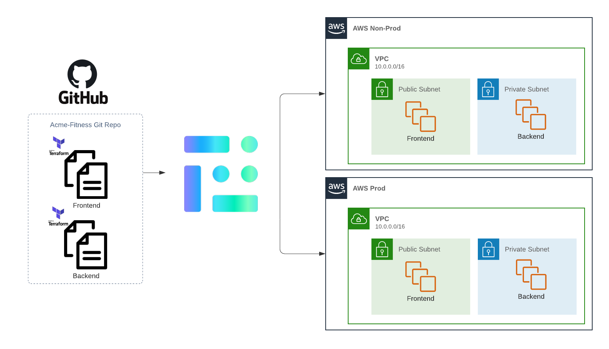

# 

## What?

### acme-fitness
acme-fitness is a public repo to help users quickly try out env0 with a collection of env0 templates and examples
It is a pretend company with its own set of services and infrastructure as code (IaC) files to manage and be deployed.

Here's a simple architectural diagram:

* We have two AWS accounts (Non-Prod & Prod) each with its own VPC
* Not pictured: s3 buckets for remote backend state management
* We have two services (frontend and backend) deployed into each AWS account (Non-Prod and Prod)
* env0 will orchestrate the deployments of those services

This repo will help showcase a collection of [features](https://docs.env0.com/docs/features) from env0.

Get an overview of how to use this repo from this [video](https://www.youtube.com/c/envZero/videos)(TBA)

## How?

1. Fork this repo, and clone it locally. See [GitHub Docs on Forking & Cloning](https://docs.github.com/en/get-started/quickstart/fork-a-repo#forking-a-repository)
2. Create an env0 Account https://app.env0.com
3. Admin access to an AWS Account [Create a Free One](https://aws.amazon.com/free/)

Disclaimer: 
Any resemblance to real persons or other real-life entities is purely coincidental. Or All characters and other entities appearing in this work are fictitious. Any resemblance to real persons, dead or alive, or other real-life entities, past or present, is purely coincidental.

Copyright (C) 2022 envZero, Inc.